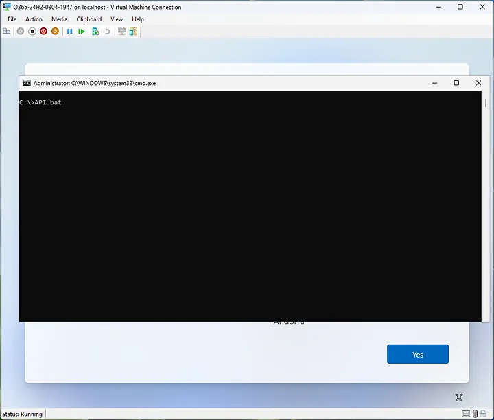
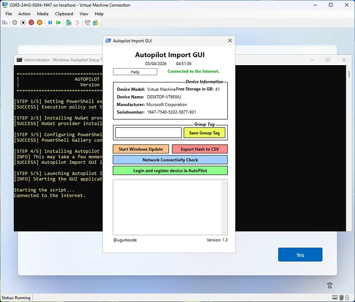
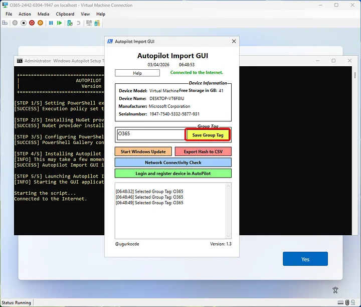
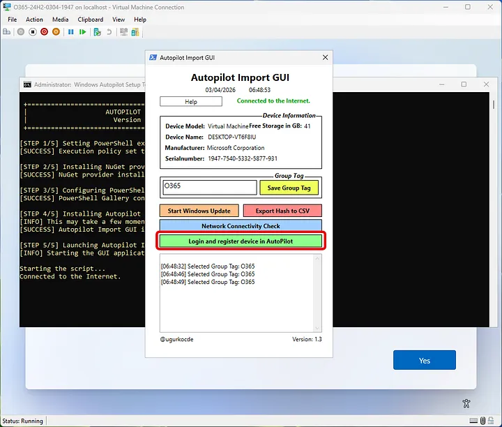
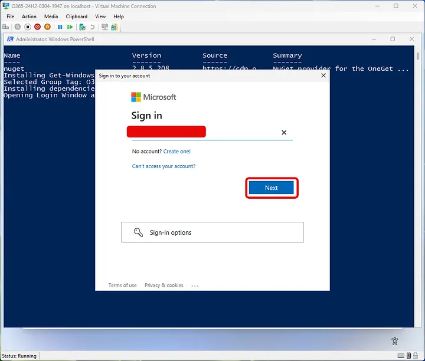
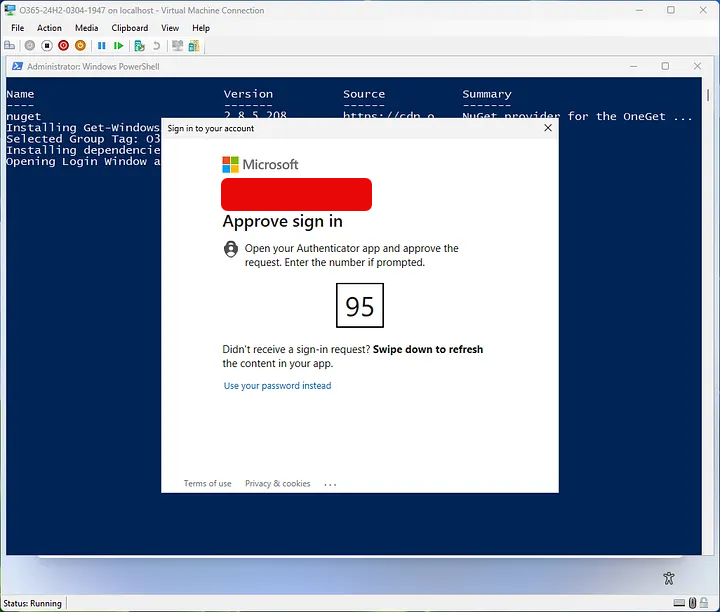
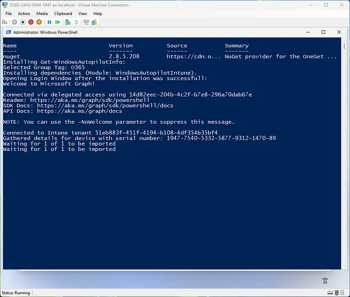
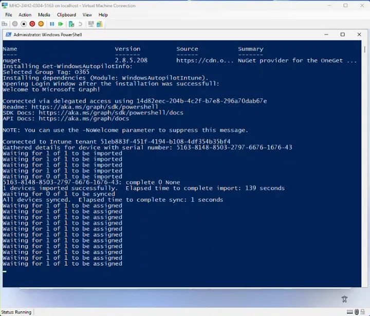

# Get-WindowsAutopilot-Import-GUI

A simple batch launcher (`API.bat`) that sets up and runs the **Windows Autopilot Import GUI**. It configures PowerShell, installs the required NuGet provider and `Get-WindowsAutopilotImportGUI` script, then launches the GUI so you can import a device into Autopilot.

## How to Run

This tool is intended to be run from within the Windows Out-of-Box Experience (OOBE) / setup screen. To launch it:

1. Copy `API.bat` to a USB thumb drive, then plug the thumb drive into the device.
2. Press **Shift + F10** to open the Command Prompt / terminal.
3. Navigate to the thumb drive (typically the **D:** drive) by typing `D:` and pressing **Enter**.
4. Type `.\API.bat` and press **Enter**.

The script will then run through its setup steps and open the Autopilot Import GUI.

## What It Does

`API.bat` performs the following steps automatically:

1. Checks for an active internet connection.
2. Sets the PowerShell execution policy to `Bypass`.
3. Installs the NuGet package provider.
4. Configures the PowerShell Gallery as a trusted repository.
5. Installs and launches the `Get-WindowsAutopilotImportGUI` script.

Once the GUI opens, use it to import the device into Windows Autopilot.

## Step-by-Step Walkthrough

**Step 8:** Type `API.bat` and press **Enter**.

**Step 9:** The batch file will run and launch the Autopilot Import GUI.

**Step 10:** Enter your Group Tag and click **Save Group Tag**.

**Step 11:** Now that the Group Tag is saved, click **Login and register device in AutoPilot**.

**Step 12:** `Get-WindowsAutopilotImport` will install, and you will be prompted to enter your enrollment account. Enter it and click **Next**, then approve the sign-in request in your Authenticator app.

**Step 13:** The device will begin to import.

**Step 14:** The device profile will begin assignment.

**Step 15:** Once assignment has completed, the device will reboot automatically without interaction.

